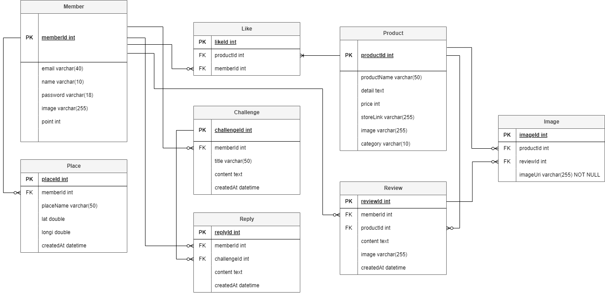

# 🌱 그린나래 🌱 (ㅇㅋ팀)

🔖 [배포 URL](https://codestates-seb.github.io/seb44_main_026/) `2023.06.28~2023.07.27`

 

## 🧑‍🤝‍🧑 Team members
| 김수성 (FE Leader) | 백승효 (FE) | 김영윤 (FE) | 백도담 (BE Leader) | 최서우 (BE) | 김리나 (BE) |
|:--------:| :--------: | :--------: | :--------: | :--------: |  :--------: |
| |  | |  |  | |
|[@KimSuSung0326](https://github.com/KimSuSung0326) | [@hyo-4](https://github.com/hyo-4) | [@youngyun213](https://github.com/youngyun213) |  [@BAEKDODAM](https://github.com/BAEKDODAM)  |[@wooseoboy](https://github.com/wooseoboy)  | [@LinaKK](https://github.com/LinaKK) |

 

## BE

| 백도담 | Challenge crud / Challenge Reply crud / map crud / image 저장 / aws 배포 |
|:--------:| :--------: |
| **최서우** | **Member crud / Jwt 사용한 로그인 / aws 배포** |
| **김리나** | **Product crud / Product review crud / Cart crud / image / aws 배포** |

 

## FE

| 백승효 | 메인페이지 / 마이페이지(회원 정보 조회, 수정) / 챌린지 페이지( 챌린지 CRUD, 챌린지 댓글 CRUD) / 배포 |
|:--------:| :--------: |
| **김수성** |  **Header / Footer / providers routing / 로그인 / 회원가입 / 지도 추가,삭제** |
| **김영윤** | **네비게이션 바 / 상품조회 페이지 / 상품상세 페이지 / 관심상품 페이지 /  리뷰 CRUD**  |

 

## 🔗 Github Rule

### Commit Convention

|  Message   | 설명                                                  |
| :--------: | :---------------------------------------------------- |
| `feat` | 새로운 기능 추가 |
| `fix` | 버그 수정 |
| `refactor` | 코드 리팩토링 |
| `style` | 코드 포맷팅, 세미콜론 누락, 코드 스타일 변경 등 |
| `remove` | 사용하지 않는 파일 또는 폴더 삭제 |
| `rename` | 파일 또는 폴더명 수정 |
| `test` | 테스트 코드, 리펙토링 테스트 코드 추가 |
| `docs` | 문서명 수정 |

 

## 💻 Stacks Used
### Back-end
|   Java   |   Spring   |   Spring Boot   |   Spring Security   |   MySQL   |   AWS   |   Spring Data JPA   |  JWT |
| :----------------------------------------------------------: | :----------------------------------------------------------: | :----------------------------------------------------------: | :----------------------------------------------------------: | :----------------------------------------------------------: | :----------------------------------------------------------: | :----------------------------------------------------------: | :----------------------------------------------------------: |
| 

 |  |  |   | 

 | 

 |  

 | 

 |

 

### Front-end
|     Html     |     CSS     |     TypeScript     |     React    |     Styled Components     |     axios     |      esLint     | 
| :----------------------------------------------------------: | :----------------------------------------------------------: | :----------------------------------------------------------: | :----------------------------------------------------------: | :----------------------------------------------------------: | :----------------------------------------------------------: | :----------------------------------------------------------:|
|  | 

 | 

 | 

 | 

 | 

 | 

 | 

 

### Tools
| Github | Discord | Notion | 
| :--------: | :--------: | :------: |
|  |  |  |

 

## 🔖 Project Docs
### 📍사용자 요구사항 정의서
    

### 📍화면 정의서
    

### 📍개발자 테스트 체크리스트
    
| no | 카테고리 | 설명 | 결과 | 비고 |
| --- | --- | --- | --- | --- |
| 1 | 회원가입 | 회원가입을 할 수 있다. | O |  |
| 2 | 회원가입 | 회원가입 시에 올바른 데이터를 입력받았는가 | O |  |
| 3 | 로그인 | 등록된 회원 정보와 일치하는 정보로 로그인에 성공한다 | O |  |
| 4 | 회원 정보 | 로그인 된 계정의 회원 정보를 조회할 수 있다 | O |  |
| 5 | 회원 정보 | 로그인 된 계정의 회원 정보를 수정할 수 있다 | O |  |
| 6 | shop | 판매 물품 리스트를 조회할 수 있다 | O |  |
| 7 | shop | 판매 물품 리스트에서 물품을 선택하면 해당 물품의 상세페이지를 조회할 수 있다 | O |  |
| 8 | shop | 물품 상세 페이지에서 리뷰를 확인할 수 있다 | O |  |
| 9 | shop | 물품 상세 페이지에서 상품을 관심 상품에 등록할 수 있다(좋아요 기능) | O |  |
| 10 | shop | 물품구매를 선택하면 실제 물품 판매 사이트로 접속할 수 있다 | X |  |
| 11 | shop | 물품 구매 후 리뷰를 작성할 수 있다 | O |  |
| 12 | shop | 작성한 리뷰를 수정할 수 있다 | O |  |
| 13 | shop | 관심등록을 취소할수있다 | O |  |
| 14 | shop | 리뷰를 작성하면 포인트를 얻을 수 있다 | O |  |
| 15 | shop | 카테고리에 따라 물품을 조회할 수 있다 | O |  |
| 16 | shop | 광고 배너와 물품 배너를 조회할 수 있다. | O |  |
| 17 | shop | 배너의 물품을 선택하면 해당 물품의 상세페이지를 조회할수있다 | X |  |
| 18 | 게시판 | 챌린지 리스트를 조회할 수 있다 | O |  |
| 19 | 게시판 | 챌린지 상세 페이지를 조회할 수 있다 | O |  |
| 20 | 게시판 | 챌린지를 등록할 수 있다(등록 시 포인트 차감) | O |  |
| 21 | 게시판 | 챌린지를 수정할 수  있다 | O |  |
| 22 | 게시판 | 챌린지를 삭제할 수 있다 | O |  |
| 23 | 게시판 | 챌린지에 댓글을 등록할 수 있다 | O |  |
| 24 | 게시판 | 챌린지에 댓글을 등록하면(챌린지 참여) 포인트를 얻을 수 있다 | O |  |
| 25 | 게시판 | 챌린지 댓글을 수정할 수 있다 | O |  |
| 26 | 지도 | 지도에서 매장 위치를 확인할 수 있다 | O |  |
| 27 | 지도 | 지도에 매장을 추가할 수 있다 | O |  |
| 28 | 지도 | 지도에 추가한 매장을 삭제할 수 있다 | O |  |

### 📍ERD
- 테이블 명세서
[greennare (1)](img/greennare%20(1)%2007440236f2b0433fada35c40253b025e.csv)

### 📍API 명세서
[API 명세서](https://greennare-cloud-run-hi2lhamh6q-du.a.run.app/swagger-ui/index.html#/)

### 배포

###  📺 발표 영상
[youtube](https://www.youtube.com/watch?v=4bbhDQS89nQ)
